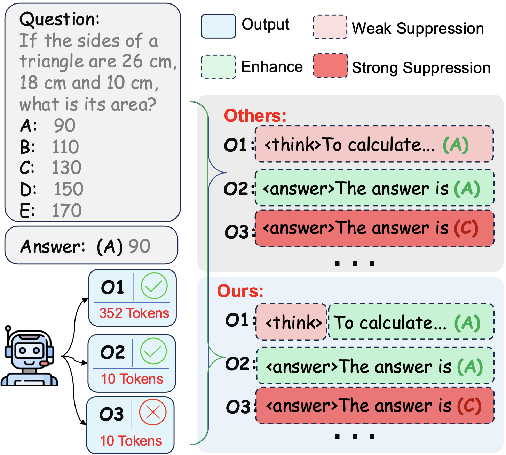

<h1 align="center">ADaPT: Token-Level Decoupling for Efficient Large Reasoning Models</h1>
<div align="center"> 

</div>

# Introduction
This repository provides the official implementation of Adaptive Dual-Process Thinking (ADaPT), a token-level framework for improving the efficiency of large reasoning models (LRMs) without degrading reasoning performance.
Unlike existing efficiency-oriented methods that apply efficiency rewards at the sequence level, ADaPT explicitly decouples efficiency and correctness signals during training.
ADaPT introduces a mode-selection token to control fast and slow reasoning, applying efficiency rewards only to this token while preserving correctness optimization for answer generation.
This design avoids penalizing correct but long chain-of-thought reasoning and maintains strong deep reasoning capability.
Moreover, ADaPT enables precise and continuous control over the efficiency–performance trade-off at inference time, allowing a single model to move smoothly along the Pareto frontier. 
<p align="center">
  
</p>

# 🚀 Quick Start
## 📦 Environment
The runtime environment is in the requirements.txt so you can

```bash
pip install -r requirements.txt
```


## Adaptive Dual-Process Thinking (ADaPT)
Compute sample embeddings and evaluate DUE scores:
```bash

python3 -m verl.trainer.main 
    config=<config_yaml>  
    data.train_files=<your_train_data>  
    data.val_files=<your_val_data>  
    data.max_response_length=<max_length>  
    worker.actor.model.model_path=<model_path>
    trainer.experiment_name=<your_experiment_name>

```

**Arguments**

- **`config=<config_yaml>`**
  Path to the YAML configuration file that defines the training setup, including model architecture, optimization parameters, and reinforcement learning settings.

- **`data.train_files=<your_train_data>`**
  Path to the training dataset in JSONL format. Each entry can contain either raw text or a prompt–response pair.

- **`data.val_files=<your_val_data>`**
  Path to the validation dataset in JSONL format, used to evaluate model performance during training.

- **`data.max_response_length=<max_length>`**
  Maximum number of tokens allowed for model-generated responses, which helps control output length and inference cost.

- **`worker.actor.model.model_path=<model_path>`**
  Path or identifier of the pretrained model used to initialize training (e.g., a HuggingFace model name or a local checkpoint directory).

- **`trainer.experiment_name=<your_experiment_name>`**
  Name of the experiment, used for logging, checkpoint management, and distinguishing between different runs.
  
## Example
We provide a small test dataset sampled to help you quickly try out ADaPT.

You can start the entire pipeline by simply running:
```bash
bash examples/adapt_train.sh
```

